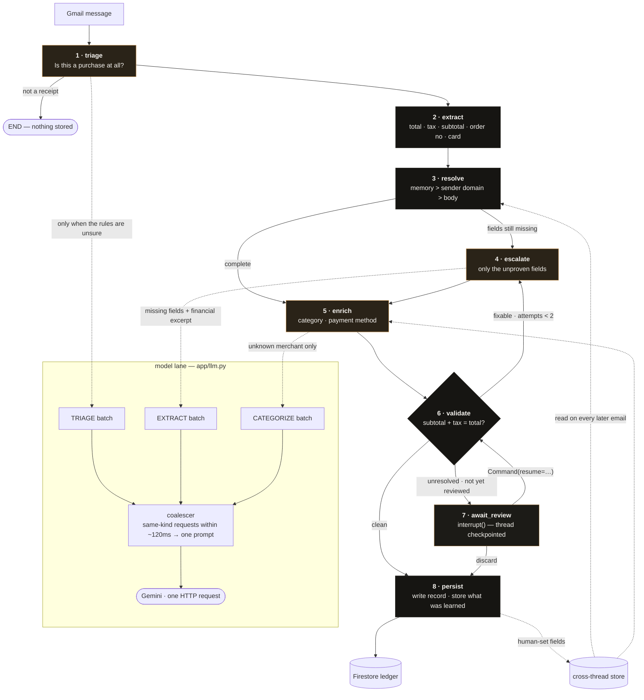

# The pipeline

> The SVG in this folder still shows the earlier seven-node version, before the
> human loop was added. The Mermaid diagram below is current.

## Two loops

**The model loop.** `validate` finds a defect a model could plausibly fix and
routes back to `escalate` with only the suspect fields — not the whole email,
not the whole record. Bounded by `MAX_ESCALATIONS = 2`, because an unbounded
retry is just a slower failure.

**The human loop.** When rules and model have both run out and the record still
does not hold up, `await_review` calls `interrupt()`. The node stops mid-
execution, LangGraph writes the thread to the checkpointer, and the run ends —
the sync moves on to other emails. Later, `Command(resume={...})` re-enters the
*same thread*, and the human's values go back through `validate`, the same
arithmetic the model had to satisfy, before `persist` writes anything.

That second loop is the reason this is a checkpointed state machine rather than
a function that returns a dict. There is no callback held in memory and no
"pending review" flag being polled: the paused computation *is* the queue.

## The two kinds of memory

They are not interchangeable, and `app/graph/persistence.py` keeps them apart.

| | Checkpointer | Store |
|---|---|---|
| Scope | one thread — one email | cross-thread, per user |
| Written | every superstep, automatically | when a human corrects a field |
| Holds | the full graph state mid-run | learned sender → vendor, vendor → category |
| Read | on resume | by `resolve` and `enrich`, on every later email |
| Lifetime | until the thread finishes | indefinitely |

Thread ids are `{user_id}:{email_id}`, so re-running a message resumes its
thread instead of starting a parallel history of it.

The store is what makes the review queue drain rather than refill: correct a
vendor once and every later email from that sender resolves with source
`memory`, which `confidence()` scores as highly as a sender-domain match.

Default checkpointer is in-process. Set `CHECKPOINT_BACKEND=sqlite` (with
`langgraph-checkpoint-sqlite` installed) to keep paused reviews across
restarts. The Review page shows which backend is live and marks any thread
whose checkpoint has expired — those answers are applied as a direct edit
instead, which skips the re-validation pass but reaches the same ledger.

## Which nodes use the model

| Node | Model? | When | What it sees |
|---|---|---|---|
| `triage` | sometimes | only when the rules can neither confirm nor rule out a purchase | sender, subject, financial excerpt (≤400 chars) |
| `extract` | never | — | — |
| `resolve` | never | — | — |
| `escalate` | yes, if reached | only for fields `extract` and `resolve` could not prove | sender, subject, financial excerpt (≤500 chars), missing field names |
| `enrich` | sometimes | only when the merchant is in neither memory nor the registry | vendor name and subject |
| `validate` | never | — | — |
| `await_review` | never | — | — |
| `persist` | never | — | — |

On the ten-receipt benchmark: seven emails needed the model for something, and
that became **two** HTTP requests, because the coalescer folds concurrent
requests of the same kind into one prompt.

## What flows through the state

Every node returns a partial state that is merged, never overwritten wholesale.
Three reducers do the merging (`app/graph/state.py`):

- `draft` — the record being built. Merged field-by-field; a `None` never
  clobbers a value an earlier node proved.
- `sources` — where each field came from: `human`, `memory`, `domain`,
  `registry`, `regex`, `llm`, `heuristic`. This is what the UI shows when you
  expand a row, and what `confidence` is computed from.
- `steps` — appended, never replaced. One line per node with its decision and
  duration; this is the trace streamed live on the Activity page.

Plus scalars: `is_receipt`, `missing`, `issues`, `attempts`, `status`,
`llm_calls`, `reviewed`, `resolution`.
